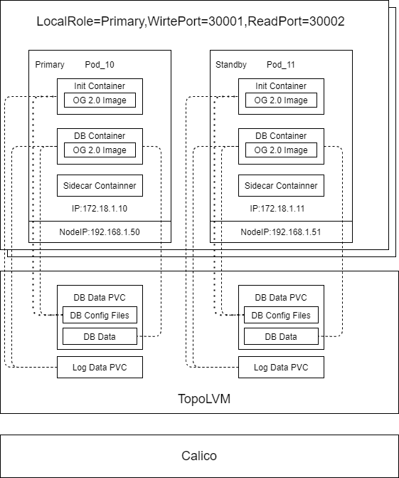

# openGauss-operator

## 介绍
openGauss Operator 是一个 Kubernetes 管理 openGauss 集群安装、维护的 Operator。

openGauss Operator 管理包括安装、维护、拓扑保持、资源升级的全生命周期。

## 功能点
### 人工介入功能
<table><tr><td>生命周期管理</td><td>从零创建集群</td></tr><tr><td></td><td>使用已有数据创建集群</td></tr>
<!-- <tr><td></td><td>单节点重启</td></tr><tr><td></td><td>集群重启</td></tr>
<tr><td></td><td>删除集群</td></tr> -->
<tr><td>集群维护</td><td>维护窗口</td></tr>
<tr><td></td><td>Pod迁移</td></tr>
<tr><td></td><td>扩容</td></tr>
<tr><td></td><td>缩容</td></tr>
<tr><td></td><td>限流</td></tr>
<!-- 
<tr><td></td><td>版本升级</td></tr><td></td><td>同城切换</td></tr> -->
</table>

### 被动处理功能
<table><tr><td>集群监控</td><td>拓扑保持</td></tr><tr><td></td><td>主库宕机</td></tr><tr><td></td><td>主库hang</td></tr>
<!-- <tr><td></td><td>主库节点宕机</td></tr> -->
<tr><td></td><td>从库故障</td></tr><tr><td></td><td>双主</td></tr></table>

## 软件架构

### 整体架构

1. Init Container
   1. Image: OpenGauss 2.0
   2. 初始化 DB 参数，修改配置
2. OpenGauss Container
   1. Image: OpenGauss 2.0
   2. 挂载 Init Container 的 Data 目录
3. Sidecar
   1. Image：OpenGauss 2.0、Filebeat
   2. 配置 DB 数据目录和备份目录
   3. 执行 gs_basebackup 全备、日志输出

### CRD

```
apiVersion: opengauss.sig/v1
kind: OpenGaussCluster
metadata:
  name: og-sample-a
spec:
  image: swr.cn-south-1.myhuaweicloud.com/opengauss/opengauss:v2.0.0  #opengauss镜像，必填属性
  sidecarimage: swr.cn-south-1.myhuaweicloud.com/opengauss/opengauss:v2.0.0   #sidecar镜像，若与image属性一致可不填
  cpu: 1                #opengauss容器的CPU资源，可选属性，默认500m
  memory: 1Gi           #opengauss容器的内存资源，可选属性，默认1Gi
  disk: 5Gi             #opengauss容器的存储资源，可选属性，默认5Gi
  bandwidth: 1Gi        #opengauss容器的带宽，可选属性，默认无限制
  logcpu: 500m          #日志容器的CPU资源，可选属性，默认200m
  logmemory: 500Mi      #日志容器的内存资源，可选属性，默认500Mi
  logdisk: 1Gi          #日志容器的存储资源，可选属性，默认1Gi
  readport: 30010       #读端口，必填属性
  writeport: 30011      #写端口，必填属性
  localrole: primary    #角色，可选值为["primary"|"remote"],表示本地或同城备库，必填属性
  iplist:               #IP/Node 列表，必填属性，不能为空
  - ip: 10.244.1.96
    nodename: k8s114node01
  - ip: 10.244.1.97
    nodename: k8s114node01
```

## 安装教程

### 必要前提

#### 资源要求：

- 服务器架构：Linux AArch64或Linux x86_64
- 内存：500M

#### 镜像
- opengauss 2.0
- filebeat
#### CNI & CSI
- CSI：topolvm
- CNI：calico

### 部署步骤

在项目目录中，编译并生成镜像文件

```
make docker-build IMG=example.com/opengauss/opengauss-operator:v0.1.0
```

可以增加docker-push命令将镜像推送到私有镜像仓库

```
make docker-build docker-push IMG=example.com/opengauss/opengauss-operator:v0.1.0
```

使用deploy命令指定镜像，在K8S环境中部署operator

```
make deploy IMG=example.com/opengauss/opengauss-operator:v0.1.0
```

部署过程包括提交CRD的yaml文件，operator相关的role配置等，并通过指定的operator镜像，在K8S环境中部署一个deployment，使用的namespace是opengauss-operator-system。

Operator部署需要通过网络下载其他依赖的镜像或者需要事先将镜像下载并放入私有镜像仓库。

<!-- ## 使用说明

1.  xxxx
2.  xxxx
3.  xxxx -->

## 参与贡献

1.  Fork 本仓库
2.  新建 Feat_xxx 分支
3.  提交代码
4.  新建 Pull Request


## 特技

1.  使用 Readme\_XXX.md 来支持不同的语言，例如 Readme\_en.md, Readme\_zh.md
2.  Gitee 官方博客 [blog.gitee.com](https://blog.gitee.com)
3.  你可以 [https://gitee.com/explore](https://gitee.com/explore) 这个地址来了解 Gitee 上的优秀开源项目
4.  [GVP](https://gitee.com/gvp) 全称是 Gitee 最有价值开源项目，是综合评定出的优秀开源项目
5.  Gitee 官方提供的使用手册 [https://gitee.com/help](https://gitee.com/help)
6.  Gitee 封面人物是一档用来展示 Gitee 会员风采的栏目 [https://gitee.com/gitee-stars/](https://gitee.com/gitee-stars/)
