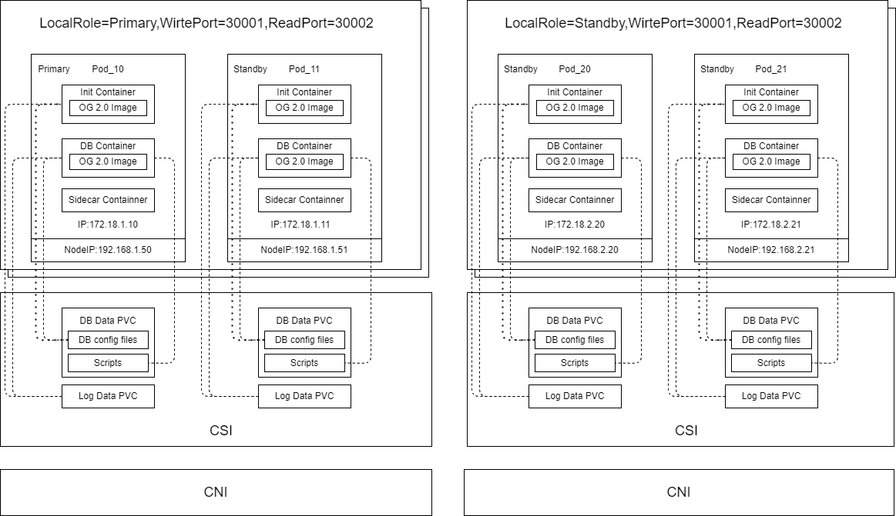

  
# openGauss-operator

## 发行说明

operator2.0是基于1.0，与之前的版本特性功能保持兼容，并在此基础上优化了部分功能：

1.优化了Pod健康查询超时机制，删除了liveness探针，readiness探针由执行脚本的方式改为tcp dbport方式

2.支持新的网络插件和存储插件，当前网络插件支持calico和kube-ovn，存储插件支持topolvm和华为分布式存储，支持混合插件部署，即支持在两个使用不同网络和存储插件的k8s环境上搭建openGauss集群

3.优化opengauss集群无主状态下选择的逻辑

4.修改了构建从库的方式，原逻辑通过gs_basebackup方式构建从库，当前通过build方式构建从库

5.优化了华为分布式存储插件下的pod创建流程，对于因Failmount方式导致Pod无法拉起的情况，将始终等待直至pvc可以成功挂载到pod上

6.kube-ovn环境下，支持pod设置多网卡，即支持pod设置两个ip，分别用于提供业务和其他服务（如备份）

7.新增日志输出，便于排查生产问题

8.修复特定场景下openGauss集群的实例格式发生变化后replconninfo配置更新问题

9.修改pod db容器的启动脚本，增加日志pvc和存储pvc使用率的输出

10.新增pod调度策略，支持部署到指定node；支持pod的liveness和readiness探针周期可配置

11.新增data pvc使用监控，data pvc存储使用达到阈值后设置为只读，即修改default_transaction_read_only为on，扩容后自动修改为off

## 介绍

### Operator介绍
> openGauss operator 是一个基于Kubernetes管理的openGauss集群安装与维护的工具，其功能主要包括数据库集群的安装部署、维护、拓扑保持、资源升级、水平扩缩容、同城切换等全生命周期管理。

#### 整体架构


1. Init Container
    1. Image: openGauss
    2. 主要作用：初始化DB参数，修改配置
2. openGauss Container
    1. Image: openGauss
    2. 主要作用：挂载Init Container的Data目录
3. Sidecar
    1. Image：openGauss & Filebeat
    2. 主要作用：
        1. 配置DB数据目录和备份目录
        2. 执行`gs_basebackup`全量备份以及日志输出
#### 读写分离设计

>读写分离设计是基于servcie和pod 添加label实现的
operator会给openGauss集群下的主、备pod角色添加对应角色的label。其中角色为主的节点，Pod的label为primary；角色为备的节点，Pod的label为standby。然后通过读写servcie根据labels映射到不同的pod，其中读service会映射到所在k8s集群opengGauss集群下所有备节点所在的Pod，写service会映射到所在k8s集群opengGauss集群主节点所在的Pod，客户端通过访问k8s集群的任一Node的ip+service的Nodeport，从而实现读写分离。
### 功能列表
openGauss operator 支持以下功能
- 集群部署 (支持单节点，多节点，及同城灾备部署）
- 集群扩容
- 集群缩容
- 集群节点迁移
- 集群资源升级（支持调整集群的CPU、内存、存储、带宽等，滚动升级）
- 同城切换
- 手工维护
- 集群删除
### 支持环境
- 机器架构
  - Linux version 3.10.0-957.el7.x86_64 
- CNI 支持类型
  - calico、kube-ovn（kube-ovn环境下，支持pod设置多网卡，即支持pod设置两个ip，分别用于提供业务和其他服务（如备份））
- CSI 支持类型
  - `hostpath`
  - topolvm
  - huawei分布式存储
  - 支持混合插件部署，即支持在两个使用不同网络和存储插件的k8s环境上搭建openGauss集群


## [安装](doc/how_to_deploy_operator.md)

### 基础镜像
1. 下载openGauss镜像

```bash
wget https://gitee.com/opengauss/openGauss-operator/releases/download/2.0/opengauss-operatorv2.tar
docker load -i opengauss-operatorv2.tar
```
2. 下载operator镜像

```bash
wget https://gitee.com/opengauss/openGauss-operator/releases/download/2.0/opengauss-5.0.2-docker.x86_64.tar
docker load -i opengauss-5.0.2-docker.x86_64.tar
```
### 单节点部署
1. 部署operator

```bash
make deploy IMG=opengauss-operator:v2.0.0
```
2. 编写openGauss集群的配置文件`sample.yaml`，并启动集群

```bash
kubectl apply -f sample.yaml 
```
`sample.yaml`

```
apiVersion: opengauss.sig/v1
kind: OpenGaussCluster
metadata:
  name: ogtest01     #pod名，根据实际情况修改
spec:
  cpu: '2'
  storage: 10Gi
  image: opengauss-5.0.2:latest
  memory: 3G
  readport: 31000
  writeport: 31001
  localrole: primary
  dbport: 26000
  hostpathroot: /docker/opengauss_operator/ogtest01    #本地存储根路径，使用本地存储时填写
  #storageclass: topolvm-class    #填写对应存储插件的storageclass即可
  networkclass: calico     #当前仅支持calico和kube-ovn两种
  config:
    advance_xlog_file_num: "10"
    archive_command: '''cp %p /gaussarch/archive/%f'''
    archive_dest: '''/gaussdata/archive/archive_xlog'''
    archive_mode: "on"
    bbox_dump_path: '''/gaussarch/corefile'''
    log_directory: '''/gaussarch/log/omm/pg_log'''
    max_connections: "2000"
  iplist:
  - nodename: node    # 宿主机hostname名
    ip: 192.170.0.110  # POD IP，根据实际情况修改
```

关于构建编译镜像步骤，参考[部署详情](doc/how_to_deploy_operator.md)

## 使用手册
### 自定义资源CRD描述
CRD主要属性见下表
| **属性名称**   | **属性类型** | **属性说明**                     |
| -------------- | ------------ | -------------------------------- |
| ReadPort       | Int          | NodePort读端口                   |
| WritePort      | int          | NodePort写端口                   |
| DBPort         | int          | OpenGauss实例端口                |
| Image          | string       | OpenGauss镜像地址                |
| LocalRole      | string       | 集群角色 ：primary /standby      |
| CPU            | string       | OpenGauss实例CPU限额             |
| Storage        | string       | OpenGauss实例存储限额            |
| Memory         | string       | OpenGauss实例内存限额            |
| BandWidth      | string       | 带宽                             |
| IpList         | IpNodeEntry  | Opengauss实例的IP和工作节点名称  |
| RemoteIpList   | []string     | 同城集群的实例IP列表             |
| BackupPath     | string       | 本地备份路径                     |
| ArchiveLogPath | string       | 本地归档路径                     |
| HostpathRoot   | string       | 本地存储路径(使用本地存储时填写) |
| StorageClass   | string       | 存储插件类型                     |
| SidecarImage   | string       | Sidecar镜像地址                  |
| SidecarCPU     | string       | Sidecar CPU限额                  |
| SidecarMemory  | string       | Sidecar内存限额                  |
| SidecarStorage | string       | Sidecar存储限额                  |
| Maintenance    | bool         | 集群维护模式                     |
| ScriptConfig   | string       | 执行脚本的配置                   |
| FilebeatConfig | string       | Filebeat配置CM                   |
#### 配置configmap
openGauss operator部署集群时，支持2个可配置的configmap，对应的cr属性分别为scriptconfig和filebeatconfig
- scriptconfig对应自定义任务执行脚本的configmap,默认配置名称**opengauss-script-config**,支持自定义配置脚本
- filebeatconfig 对应执行脚本的configmap,默认配置名称：**opengauss-filebeat-config**,支持自定义配置，将日志通过filebeat转发到es或其他。默认配置转到es，设置如下，部署时需要根据实际情况修改

关于配置configmap的具体细节，详见[配置configmap详情](doc/manage_CRD_configmap.md)
### 创建集群
operator成功部署以后，就可以通过其部署OG应用。根据输入的配置文件不同，可以部署不同架构的OG应用，包括但不限于：
- 单节点
- 主从架构
- 同城双集群部署

部署OG应用
```bash
kubectl apply -f cluster.yaml
```
查询应用的部署状态
```bash
kubectl get opengausscluster <name>
```
og部署验证通过后，通过容器内的client连接OG
```bash
kubectl exec -it -n <namespace> <pod name> -c og -- gsql -d <dbname> -p <port> -c "<command/sql>"
```
通过容器内的数据库服务控制工具`gs_ctl`查看og集群的详细信息:
```bash
kubectl exec -ti -n og <pod name> -c og  -- gs_ctl query -D <directory of gauss instance>
```
部署详情见[openGauss集群部署详情](doc/deploy_og_cluster.md)
### 同城双集群部署
og集群部署在两个k8s上，每个k8s各有一个节点，组成HA集群，前提需要**保证两个k8s集群网络的连通性**，其中：
1. 部署在本地集群的localrole应设置为primary，同城集群的localrole为standby
2. 同城双集群部署与单集群部署的区别除了localrole的属性的值设置外，还包括**remoteiplist**属性
3. 本地集群和同城集群CR的yaml文件中需要分别增加对方集群的Pod Ip.
4. 先部署本地集群，在部署同城集群

分别在两个k8s上查询应用的部署状态，直到同城和本地集群STATE都为ready： 
```bash
kubectl get opengaussclusters.opengauss.sig -n og
```
查询应用的部署Pod的主从角色：
```bash
kubectl get pod -n og --show-labels
```
验证部署，通过本地集群容器内的client去连接OG：
```bash 
$  kubectl exec -ti -n <namespace> <pod name> -c og -- gsql -d <dbname> -p <port> -c "<command/sql>"
```
通过容器内的数据库服务控制工具`gs_ctl`查看og集群的详细信息：
```bash
$ kubectl exec -ti -n <namespace> <pod name> -c og -- gs_ctl query -D <directory of gauss instance>
```
同城部署详情请参考[openGauss同城部署与切换详情](doc/intracity_og_cluster.md)

### 同城切换
同城切换功能，只需要分别修改本地集群和同城集群CR的localrole即可：
1. 修改本地集群CR的localrole为standby
2. 待本地集群原有primary的pod labels标记为standby后，修改同城集群CR的localrole为primary，防止出现双主
3. 切换过程中，本地集群的cr状态由ready变为update，之后可能为变为recovering，待切换完成后，会变为ready
4. 同样切换过程中，同城集群的cr状态由ready变为update，之后可能为变为recovering，待切换完成后，会变为ready，同城集群的会自动选择一个pod为主

验证灾备切换是否成功，通过容器内的数据库服务控制工具`gs_ctl`查看原同城集群的详细信息。<br>
同城集群切换的详细信息请参考[openGauss同城部署与切换详情](doc/intracity_og_cluster.md)

### 删除集群
删除openGauss集群，只需要执行k8s命令删除cr即可。需要注意的是，**删除openGauss集群后，该CR的pvc仍然存在**

执行k8s删除命令，删除cr
```bash
kubectl delete opengaussclusters.opengauss.sig -n <namespace name> <cr name> 
```
删除cr资源后，其PVC仍然保留，以防止需要恢复数据。当确定要删除PVC时，首先查看og集群的pvc
```bash
kubectl get pvc -n  <namespace name> |grep <cr name> 
```
确认数据不需要保存时，直接删除PVC资源即可，避免资源的浪费
```bash
kubectl delete pvc <pvc name> -n <namespace name>
```
删除集群的具体操作请参考[删除openGauss集群详情](doc/delete_og_cluster.md)

### 其他运维操作步骤(单机&同城)
#### 扩容
opengauss 集群的扩容是通过修改CR的iplist属性来实现的，即：
```yaml
...
iplist:
  - ip: 172.16.0.2
    nodename: node1
...
```
扩容即新增iplist的一个元素，通过调整openGauss的iplist，例如：
```yaml
...
iplist:
  - ip: 172.16.0.2
    nodename: node1
  - ip: 172.16.0.5
    nodename: node1
...
```
更新配置文件后对集群重新进行部署
```bash
kubectl apply -f cluster.yaml
```
查询应用的部署状态，直到pod的STATE由初始的ready变为updating，最终变为为ready： 
```bash
kubectl get opengaussclusters.opengauss.sig -n og
```
查询应用的部署Pod的主从角色：
```bash
kubectl get pod -n og --show-labels
```
openGauss集群扩容具体细节请参考[operator常见运维操作](doc/og_adjust_cluster.md)
#### 缩容
缩容的操作与扩容相似，不同的地方在于已经部署的openGauss集群，减少iplist的配置信息。
#### 资源升级
opertor支持og集群的资源升级，即修改已有集群的内存，CPU,带宽，存储容量等大小。需要特别注意的是： 
- **存储容量仅支持扩容，不支持缩容**
- **如果资源调整涉及cpu和内存、带宽资源调整，会重启pod。同时如果为多节点部署，会发生*主从切换***

编辑CR的yaml文件，保存后重新部署
```bash
kubectl apply -f cluster.yaml
```
在CR重新部署后，等待pod的STATE恢复为ready，资源更新完成。
openGauss集群扩缩容详细信息请参考[openGauss资源升级](doc/og_cluster_update.md)
#### 手工维护
当存在operator不能恢复需要人工干预情况，或者需要手工进入到og集群的库中进行一些运维操作，且人为维护期间不希望operator继续处理对应集群时，可以修改集群对应CR的`maintenance`属性。
```yaml
···
  readport: 30120
  writeport: 30121
  dbport: 26000 
  localrole: primary
  maintenance: true
···
```
`maintenance`属性默认值为`fasle`，支持修改，当`maintenance`为`true`时，operator不会干预对应集群运行，无论此时集群状态正常/异常。
##  故障诊断
### Operator 看状态查日志
operator默认采用Deployments方式部署，默认部署在opengauss-operator-system命名空间下

查看operator的Deployments状态及其对应pod的状态
```bash
# 查看operator的Deployments状态
kubectl get deployments.apps  -n <namaspacename>
# 查看operator的pod的状态
kubectl get pod  -n <namaspacename>
```
查看operator日志
```bash
kubectl logs -f -n <namespacename> <podname>
```
查看operator pod信息
```bash
kubectl get pod  -n opengauss-operator-system
```
查看operator的日志
```bash
kubectl logs -f -n opengauss-operator-system <operator pod name>
```
### OG 看状态查日志
查看opengauss集群的状态 
```bash
kubectl get opengaussclusters.opengauss.sig  -n <namespacename> <crName>
```
查看opengauss集群的状态的详情
```bash
kubectl describe opengaussclusters.opengauss.sig  -n <namespacename>  <crName>
```
查看 og集群下pod的日志
```bash
kubectl logs -f -n  <namespacename> <podName>
```
故障诊断详细信息请参考[故障诊断手段](doc/failure_diagnose.md)
## 连接方式
用户可以通过service连接数据库，部署的og集群，会有对应的写servcie和读service
写service可读可写；读service仅可以进行读操作
### NodePort(读写分离)
部署og集群时，会创建两个service：读service和写service
service命名规则如下
- 写service og-<cr名称/集群名称>-svc
- 读service og-<cr名称/集群名称>-svc-read
```bash
kubectl get svc -n og |grep ogtest
og-ogtest-svc        NodePort   10.102.11.89    <none>        5432:30002/TCP   6d1h
og-ogtest-svc-read   NodePort   10.97.134.48    <none>        5432:30001/TCP   6d1h
```
### Pod ip 直连(underlay)
### 示例：外部客户端配置方式-java
示例
og命名空间下存在一主一从的og集群ogtest
```bash
$ kubectl get opengaussclusters.opengauss.sig -n og 
NAME     ROLE      CPU    MEMORY   READ PORT   WRITE PORT   DB PORT   STATE   AGE
ogtest   primary   500m   2Gi      30001       30002        5432      ready   6d2h

# 对应的读写service
$ kubectl get svc -n og |grep ogtest                   
og-ogtest-svc        NodePort   10.102.11.89    <none>        5432:30002/TCP   6d2h
og-ogtest-svc-read   NodePort   10.97.134.48    <none>        5432:30001/TCP   6d2h
```
客户端连接db时，使用k8s集群下任一node的ip 和写service的noteport就可以连接数据库


## 故障案例
### openGauss集群故障
operator会监控集群中 og集群的pod，当监测到pod故障后，会尝试将其重新拉起。案例包括但不限于：
- 单点pod故障
- 1主1从Primary pod故障
- 1主1从Standby pod故障
- 存储故障 - 可分配空间不足(vg)
- 存储故障 - data pvc存储空间不足


详见[openGauss集群故障恢复案例](doc/faliure_pod.md)
### operator故障
详见[operator集群故障恢复案例](doc/faliure_operator.md)